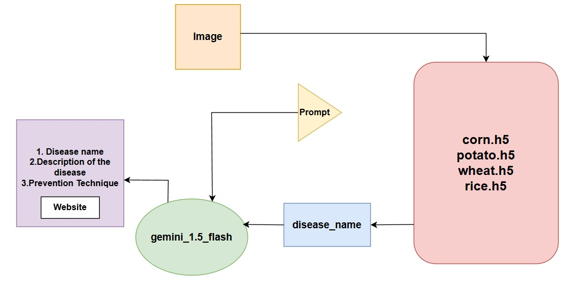
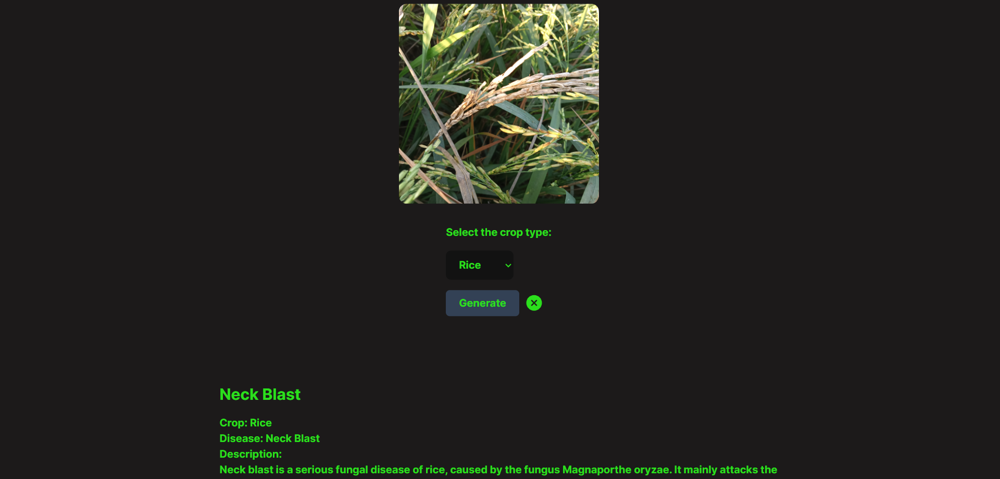
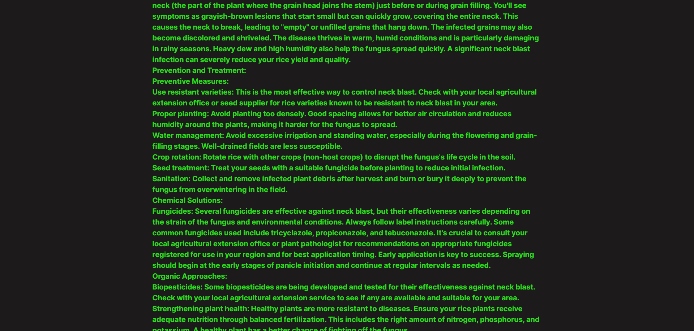
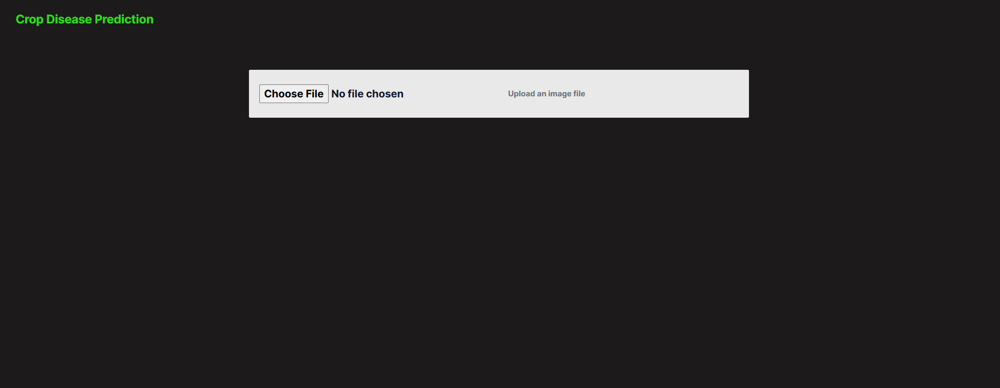

# AgroNet: An Attention-Enhanced Ensemble Framework for Precision Crop Disease Detection 🌾🤖

**AgroNet** is a deep learning-based system for detecting crop diseases in images of corn, potato, wheat, and rice. The framework integrates ensemble models, including MobileNetV2, InceptionV3, and EfficientNetB1, with attention mechanisms to focus on disease-specific features. It is designed to assist in precision agriculture by providing accurate disease classification and offering practical, real-time solutions for crop health monitoring.

## Table of Contents 📜

- [Introduction](#introduction)
- [Features](#features)
- [System Architecture](#system-architecture)
- [Frontend UI Preview](#frontend-ui-preview)
- [Installation](#installation)
- [Usage](#usage)
- [Data](#data)
- [Training the Model](#training-the-model)
- [Evaluation](#evaluation)
- [Contributing](#contributing)
- [License](#license)

## Introduction 📖

The need for automated and accurate crop disease detection has become critical to ensure sustainable farming practices and food security. AgroNet leverages state-of-the-art deep learning techniques to classify crop diseases and assist farmers with timely intervention. The project uses an ensemble learning approach combining MobileNetV2, InceptionV3, and EfficientNetB1, enhanced by attention mechanisms for precise feature extraction.

### Key Features:
- **Ensemble Learning**: Combines MobileNetV2, InceptionV3, and EfficientNetB1 for robust performance.
- **Attention Mechanisms**: Refines feature extraction, focusing on the most relevant parts of images.
- **High Accuracy**: Achieved classification accuracies of 95.68% (Corn), 98.16% (Potato), 98.31% (Wheat), and 98.44% (Rice).
- **Data Augmentation**: Applies various augmentation techniques to improve model generalization.

## Features 🚀

- **Disease Classification**: Identifies diseases such as Corn_Common_Rust, Potato_Early_Blight, Wheat_Yellow_Rust, and Rice_Neck_Blast.
- **Generative AI Integration**: Provides detailed disease descriptions and prevention strategies using the Gemini 1.5 Flash model.
- **Real-Time Deployment**: Can be used with mobile apps, IoT devices, and drones for real-time disease monitoring.
- **Scalable**: The modular system allows the easy addition of new crop models.

## System Architecture 🏛️

Below is an overview of the AgroNet system architecture:



## Frontend UI Preview 🎨

Here are some examples of how the UI looks:

| Disease Detection Screen 1 | Disease Detection Screen 2 | Main Frontend Dashboard |
|:---------------------------:|:---------------------------:|:-----------------------:|
|  |  |  |

## Installation ⚙️

### Prerequisites 🧰

- Python 3.7 or higher
- TensorFlow 2.x
- Keras
- FastAPI (for backend API)
- React (for frontend)
- Node.js (for frontend setup)

### Setup 🛠️

1. **Clone the repository:**
   ```bash
   git clone https://github.com/rahultalukdargithub/AgroNet.git
   cd AgroNet
   ```

2. **Install required dependencies:**
   ```bash
   pip install -r requirements.txt
   ```

3. **Setup the frontend:**

   - Navigate to the frontend directory:
     ```bash
     cd frontend
     ```

   - Install Node.js dependencies:
     ```bash
     npm install
     ```

   - Run the React development server:
     ```bash
     npm start
     ```

4. **Setup the backend:**

   - Navigate to the backend directory:
     ```bash
     cd ../backend
     ```

   - Run the FastAPI server:
     ```bash
     uvicorn app:app --reload
     ```

---

## Usage 🧑‍💻

### Disease Detection 🌱

- Upload an image of a crop leaf (healthy or diseased).
- Select the crop type (Corn, Potato, Wheat, Rice).
- The backend processes the image using the appropriate pre-trained model.
- The system predicts the disease and provides detailed descriptions and prevention methods.

---

## Data 📚

The dataset used in this project contains images of four major crops (Corn, Potato, Wheat, Rice) and their respective diseases. The images were preprocessed, and augmentations such as rotation, flipping, and brightness adjustments were applied.

**Dataset Link**: [Bangladeshi Crop Disease Dataset on Kaggle](https://www.kaggle.com/datasets/nafishamoin/new-bangladeshi-crop-disease)

---

## Training the Model 🏋️‍♂️

The data is split into training, validation, and test sets (70% training, 15% validation, 15% testing).

### Model Architecture:

- MobileNetV2 and InceptionV3 for Corn, Potato, and Wheat.
- EfficientNetB1 for Rice.

### Command for training:
```bash
python train.py --data-path <path_to_data>
```

---

## Evaluation 📉

Once trained, the model can be evaluated using the following metrics:

- **Accuracy**: Overall performance.
- **Precision**: Exactness of the model.
- **Recall**: Completeness of the model.
- **F1-score**: Harmonic mean of precision and recall.

### Command for evaluation:
```bash
python evaluate.py --model-path <path_to_trained_model> --data-path <path_to_test_data>
```

---

## Contributing 🤝

We welcome contributions to improve the project. Follow these steps:

1. Fork the repository.
2. Create a new branch:
   ```bash
   git checkout -b feature-name
   ```
3. Commit your changes:
   ```bash
   git commit -am 'Add new feature'
   ```
4. Push to the branch:
   ```bash
   git push origin feature-name
   ```
5. Create a new Pull Request.

---

## License 📄

This project is licensed under the MIT License - see the [LICENSE](LICENSE) file for details.

---

